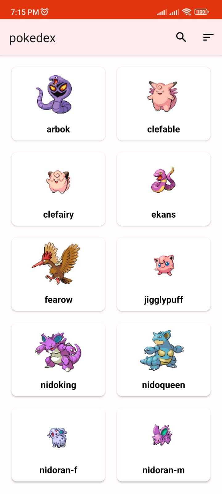
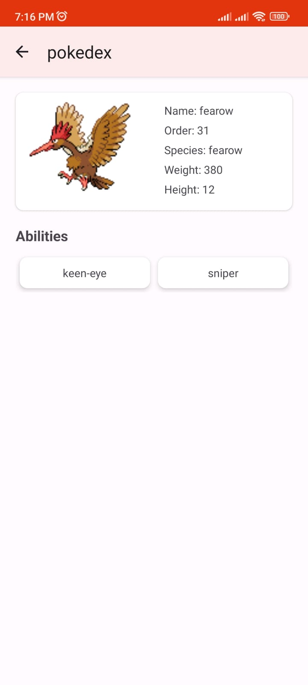

# pokedex

## Screenshot

  
  
  
  

API from [pokeapi](https://pokeapi.co/docs/v2)

## Features
- List of Pokémon
- Search for specific Pokémon
- Sort Pokémon
- View detailed information about a Pokémon

## Tech Stack
- MVVM (Model-View-ViewModel) Architecture Pattern
- Modularization (core module)
- Clean Architecture (data, domain, presentation)
- Dependency Injection with Dagger Hilt
- Coroutines Flow
- ViewBinding
- Room DB
- Encryption with SQLCipher

## Dependencies
- [Glide](https://github.com/bumptech/glide)
- [Lottie](https://github.com/airbnb/lottie-android)
- [AndroidX](https://mvnrepository.com/artifact/androidx)
- [Lifecycle & LiveData](https://developer.android.com/jetpack/androidx/releases/lifecycle)
- [Dagger Hilt](https://dagger.dev/hilt/)
- [Retrofit](https://square.github.io/retrofit/)
- [Coroutines Flow](https://developer.android.com/kotlin/flow)
- [Room](https://developer.android.com/training/data-storage/room?gclid=Cj0KCQiA0MD_BRCTARIsADXoopYlw1cozWjwyR-ucLYa-aoqYlZeJmxG34JnhByjApMNwuchOcAzcy0aAgGHEALw_wcB&gclsrc=aw.ds)
- [SQLCipher](https://github.com/sqlcipher/sqlcipher)
- [SQLite](https://developer.android.com/jetpack/androidx/releases/sqlite)
- [Okhttp3](https://square.github.io/okhttp/)
- [Circle Image](https://github.com/hdodenhof/CircleImageView)
- [Timber](https://github.com/JakeWharton/timber)
